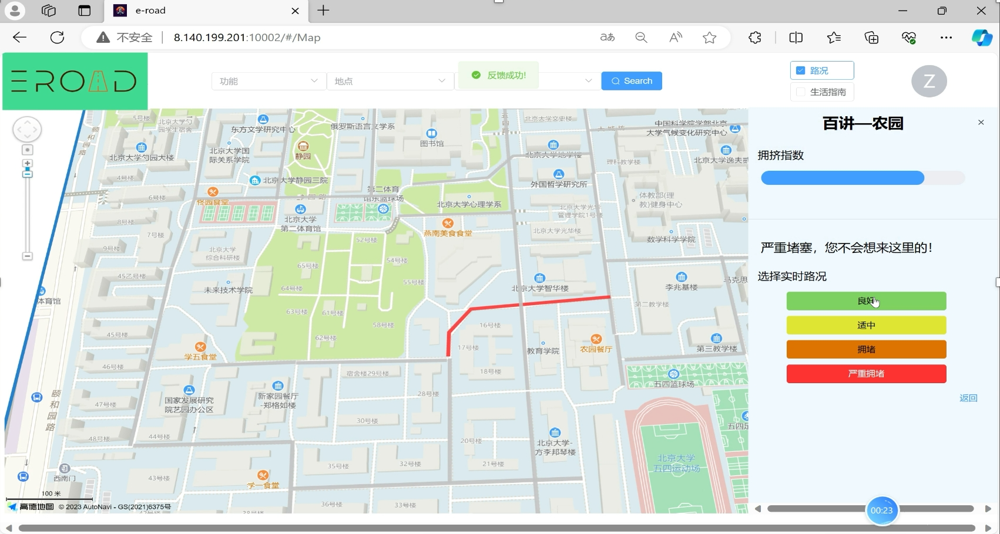

# E路相伴

E路相伴是一个校内的功能性地图软件。

对许多同学来说，校内一些地点相关的信息的获取面临着渠道多而杂，信息不精确、不及时，缺少系统性分类等问题。例如想要找打印店的位置，可以在院系公众号上查找是否有相关介绍，也可以在树洞、BBS上搜索相关交流，想要获得符合需求的信息就需要在多个渠道进行查询，即便如此查到的信息可能还会有不少重复信息。而且查找到的信息也可能并不精确，例如只知道理科一号楼可以打印，但具体在哪里并不清楚，或者已经失去了时效性。此外，受限于论坛的交流形式以及篇幅，可能很难面面俱到地介绍一个地点。这些问题为同学们的学习、生活带来了较大不便。

因此，我们小组计划开发这款地图软件，目的是解决上面提到的问题。

作为一个Web应用，本软件能：
- 实时提供学校道路拥堵与食堂拥堵情况
- 提供学校院楼内的各种信息，如打印机位置、咖啡店、教务办公时间等
- 以地点为节点，集成地点的常用信息，成为一个可视化生活指南
- 作为学生与学生之间的交流平台
- 重点提供功能性的地图软件，而不是提供各种信息的地图软件

本软件开发过程中各阶段文档和demo详见文件夹[第1阶段](第1阶段)~[第5阶段](第5阶段)，项目仓库位于[E路相伴
](https://github.com/PKUSECoursePracticeSupportGroup/SE_project_2023)。