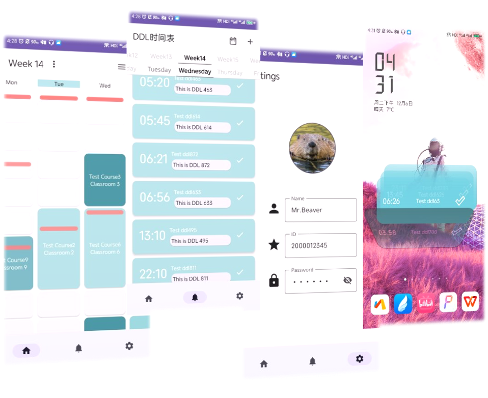

# Time Manager

Time Manager是⼀款将课程表和DDl结合为核⼼的学⽣的时间管理⼯具。

我们考虑到大学生学习中可能困扰于记录安排诸多 DDL 与课程学习的矛盾之中，为了帮助大学生(尤其是本校大学生)更好地查询课程时间与任务、记录 DDL、安排学习与任务时间，我们设计构思了这款软件。

本软件为大学生提供了：
- 更加自由与易查看的课程表
- 更加直观与轻交互的DDL
- 更加高效和自动化的课程表/DDL增修
- 更加直观和本地化的用户界面

本软件开发过程中各阶段文档和demo详见文件夹[第1阶段](第1阶段)~[第5阶段](第5阶段)，项目仓库位于[time-manager](https://github.com/PKUSECoursePracticeSupportGroup/time-manager)。
